# 🎤 Voice Note Transcription & Notion Integration

[](https://www.python.org/downloads/)
[](LICENSE)
[](https://flocode.substack.com/)
[]()

A powerful command-line tool for transcribing voice notes and automatically generating structured meeting minutes in Notion. Perfect for engineers, project managers, and professionals who want to streamline their meeting documentation workflow.

---

## 🌊 **About Flocode**

This tool is part of [**Flocode's**](https://flocode.substack.com/) open-source initiative to empower civil and structural engineers with practical AI-powered tools. As a **free community resource**, you're welcome to take this tool, modify it, and make it your own! 🚀

---

## ✨ Features

| Feature | Description |
|---------|-------------|
| 🎤 **High-Quality Transcription** | Utilizes Groq (whisper-large-v3-turbo) and OpenAI Whisper for accurate speech-to-text conversion |
| 🤖 **AI-Powered Summarization** | Leverages Google Gemini (with OpenAI fallback) to generate structured meeting minutes |
| 📝 **Notion Integration** | Automatically creates formatted entries in your Notion database with proper markdown rendering |
| 🔔 **Real-Time Notifications** | Desktop notifications keep you informed of processing status |
| 💾 **Local Backups** | Maintains local markdown backups of every transcription for your records |
| 🔒 **Secure Configuration** | All API keys managed securely through environment variables |
| 🚀 **Drag & Drop Processing** | Simply drag audio files onto the batch script for instant processing |
| 📊 **Queue Management** | Add multiple files and URLs to a processing queue for batch operations |

## 🚀 Getting Started

### 📋 Prerequisites

Before you begin, ensure you have the following installed:

-  **Python 3.12+**
-  **`uv`**: Fast Python package installer
  ```bash
  pip install uv
  ```
-  **FFmpeg**: Required for audio processing

### 📦 Installation

**1. Clone the repository:**
```bash
git clone https://github.com/your-username/whisper_2.0.git
cd whisper_2.0
```

**2. Install dependencies:**
```bash
uv sync
```

**3. Install FFmpeg:**

<details>
<summary>🪟 Windows (with Chocolatey)</summary>

```powershell
choco install ffmpeg
```
</details>

<details>
<summary>🍎 macOS (with Homebrew)</summary>

```bash
brew install ffmpeg
```
</details>

<details>
<summary>🐧 Linux (with apt)</summary>

```bash
sudo apt update && sudo apt install ffmpeg
```
</details>

### ⚙️ Configuration

**1. Create your `.env` file:**
```bash
cp .env.example .env
```

**2. Configure your API keys:**

| Service | Environment Variable | Purpose | Required |
|---------|---------------------|---------|----------|
|  | `OPENAI_API_KEY` | Transcription & Summarization fallback | ✅ |
|  | `GROQ_API_KEY` | Fast transcription (recommended) | 🔄 |
|  | `GEMINI_API_KEY` | Enhanced summarization | 🔄 |
|  | `NOTION_API_KEY` | Database integration | ✅ |
|  | `NOTION_DATABASE_ID` | Target database | ✅ |
| 🏢 | `COMPANY_NAME` | Personalized minutes | ⚪ |
| 🏢 | `COMPANY_SHORTHAND` | Company abbreviation | ⚪ |

> **Legend:** ✅ Required | 🔄 Optional (recommended) | ⚪ Optional (nice-to-have)

### 🧪 Test Your Setup

Verify everything is configured correctly:
```bash
uv run python tests/test_voice_system.py
```

## 💻 Usage

### 🎯 Quick Start (Recommended)

**Drag & Drop Processing:**
1. Create a desktop shortcut to `quick_process.bat`
2. Drag your audio file onto the shortcut
3. Watch the magic happen! ✨

### 🔄 Interactive Mode

Perfect for managing multiple files:
```bash
uv run python scripts/process_voice_notes.py --interactive
```

**Available commands:**
- `add <file_or_url>` - Add to processing queue
- `queue` - Show current queue
- `process` - Process next item
- `p` - Process all items
- `clear` - Clear queue
- Direct file paths work too!

### ⚡ Command-Line

For direct processing:
```bash
uv run python scripts/process_voice_notes.py /path/to/your/audio.mp3
```

---

## 🎯 **My Preferred Workflow**

### 🎙️ **Recording Setup with VoiceMeeter Banana**

**Step 1: Audio Capture**
- Use [**VoiceMeeter Banana**](https://vb-audio.com/Voicemeeter/banana.htm) to record **both** desktop audio and microphone input into a single audio file for transcription.


**Step 2: Instant Processing**
1. **Create a desktop shortcut** to `quick_process.bat` 
2. After your meeting ends, **drag the audio file** directly onto the shortcut
3. The script handles everything automatically:
   - ✅ Transcribes the entire conversation
   - ✅ Generates structured meeting minutes  
   - ✅ Saves to Notion with proper formatting
   - ✅ Creates local markdown backup
   - ✅ Sends you a completion notification


### 🎛️ Alternative: GUI File Selection

For a more traditional approach, use `select_and_process.bat` to browse and select files through a Windows dialog.

> **⚖️ Legal Notice:** Always obtain proper consent before recording conversations. Comply with local laws and regulations.

## 🔧 How It Works

```mermaid
graph TD
    A[📁 Audio File] --> B[🔄 Queue Management]
    B --> C[✂️ Audio Chunking]
    C --> D[🎤 Transcription<br/>Groq/OpenAI Whisper]
    D --> E[🤖 AI Summarization<br/>Gemini/GPT-4]
    E --> F[📝 Notion Integration<br/>Formatted Markdown]
    E --> G[💾 Local Backup<br/>Markdown File]
    F --> H[🔔 Success Notification]
    G --> H
```



**Process Flow:**
1. **📋 Queue Management** - Files and URLs organized in processing queue
2. **🎵 Audio Processing** - Files chunked for optimal API handling  
3. **📝 Transcription** - High-quality speech-to-text conversion
4. **🧠 Summarization** - AI-powered meeting minutes generation
5. **💾 Dual Storage** - Notion database + local markdown backup

---

## 🤝 Contributing

We welcome contributions from the engineering community! This is an open-source Flocode initiative.

- 🐛 **Found a bug?** Open an issue
- 💡 **Have an idea?** Start a discussion  
- 🔧 **Want to contribute?** Submit a pull request

## 📜 License

This project is licensed under the **MIT License** - see the [LICENSE](LICENSE) file for details.

**Free for commercial and personal use.** 🎉

---

## 🌊 **Built with ❤️ for the Flocode Community**

*Empowering engineers with practical AI tools, one voice note at a time.*

**James 🌊**

---

[](https://flocode.substack.com/)